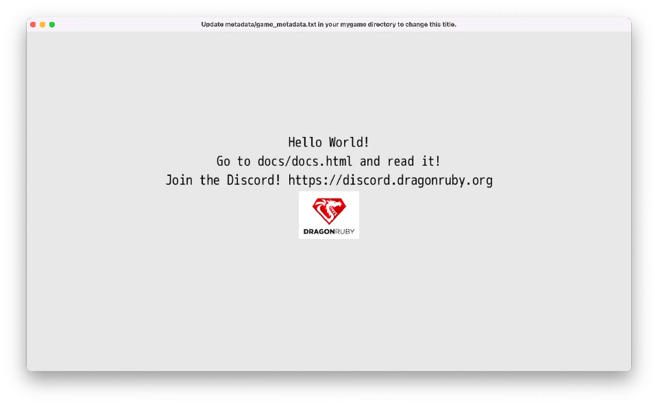

# Hello, Dragon!

We'll start by rendering an image and some simple text on the screen. But first, we need to get our computer and DragonRuby Game Toolkit ready for developing.

## First Steps

1. **Download a code editor:** Since you'll be coding your game, you need a special text editor to let you write the code without any extra formatting that text editors like Microsoft Word add. [Visual Studio Code](https://code.visualstudio.com/) is a great free editor. Downloa and install it.
2. **Get DragonRuby GTK:** You need to get a copy of DragonRuby GTK so you can use the engine. [Buy it on Itch and download the zip file for your operating system.](https://dragonruby.itch.io/dragonruby-gtk/purchase)
3. **Extract the DRGTK engine zip**: In your computer's file explorer, extract the engine zip file.

You're ready to work on your game. Let's get to it!

PROTIP: don't delete the zip file! You can unzip it again for when you start working on your next game. It's helpful to keep it around.

## What's in the Engine Zip

When you download DragonRuby Game Toolkit, it contains everything you need to build your game. There's no external dependencies to install or monkey with. You just use the provided files and start making your game.

Let's go over the key files in the archive you just extracted:

- `dragonruby` — the executable you'll run to launch your game in development mode, you're primary entry into the development flow
- `dragonruby-publish` — a command-line tool to help you easily build and publish your game online, don't worry about this yet!
- `samples/` — a folder of example code that you can run if you'd like, or just ignore it for now
- `docs/` — the DragonRuby Game Toolkit docs for the version you've downloaded, extremely handy if you want to dive deeper than this book
- `mygame/` 🌟 — as the name implies, this is where the code, graphics, sound, and other assets live for your game; this is the primary folder you'll be working in
    - `app/` — this is where your Ruby code goes
      - `main.rb` — this is the main file for your game code, don't worry about the other two yet
    - `data/` — where you can put any data for your game, like level editor files
    - `fonts/` — where fonts go, duh!
    - `metadata/` — configuration files for your game, we'll do more here later
    - `sounds/` — where music and sound effects go
    - `sprites/` — where images go that will be rendered in the game

Don't worry about the other files yet. Focus on the `mygame/` directory, and, specifically, `mygame/app/main.rb`.

## Start the Game

Launch the `dragonruby` file.

If you're on MacOS, right-click the file and select "Open". You'll need to ensure software from unverified sources can be installed.

Here's what gets displayed:



This isn't a game... yet! But it is doing three key things:

1. Launching an app window
2. Rendering text
3. Displaying an image

And you haven't even written any code yet. Not a bad starting place.

DRGTK handles the unfun stuff of making games—dealing with low-level APIs like graphics, window, and sounds. We can instead focus on making our game.

## An Overview of the Main Game File

Let's take a look at what's in `mygame/app/main.rb`:

``` ruby
def tick args
  args.outputs.labels  << [640, 500, 'Hello World!', 5, 1]
  args.outputs.labels  << [640, 460, 'Go to docs/docs.html and read it!', 5, 1]
  args.outputs.labels  << [640, 420, 'Join the Discord! https://discord.dragonruby.org', 5, 1]
  args.outputs.sprites << [576, 280, 128, 101, 'dragonruby.png']
end
```

You can open this file yourself in Visual Studio Code. Go ahead and do that: New Window > Open > [select the folder on your computer with the engine in it]

Six lines of codes to render text and an image? Not bad! (Trust me, if you did this all from scratch without an engine, it'd take at least hundreds of lines of code.)

Here's what that code does, line by line:

``` ruby
def tick args
```

This `def`ines method called `tick` and passes in an argument called `args`. Methods are reusable pieces of code that you can call to do something over and over again. Methods are a foundational building block of code that allow for code reuse. `args` is a bunch of data that gets passed into `tick` whenver it is called. We'll learn more about `args` soon.

The next three lines handle outputting text to the screen:

``` ruby
args.outputs.labels  << [640, 500, 'Hello World!', 5, 1]
args.outputs.labels  << [640, 460, 'Go to docs/docs.html and read it!', 5, 1]
args.outputs.labels  << [640, 420, 'Join the Discord! https://discord.dragonruby.org', 5, 1]
```

Your eyes might be melting a little bit. But don't worry, wipe that melted bit of eye away and focus! It's actually pretty intuitive once you get the hang of it.

Remember `args` from above? That parameter that's passed into `tick`? Well, you can call methods on it! This allows you to interact with the game engine.

`args` has a method called `outputs` that represents the data that gets rendered in the screen. You access it with `args.outputs`. Neato! `labels` is method on the `outputs`, see how the `.` chains things together?

The `<<` is called the shovel operator. It lets you push data into a collection. `labels` is the collection we're shoveling data into because we want to render some text.

And then finally the code within the brackets `[]` is an array of data that represents what we want to display on the screen. It may not be clear exactly what it's doing yet, but it'll become more clear over time.

[array illustration]

You can see some code in quotes, those are strings. And they're what's being displayed by the game. In order to show the text, though, we need to tell the engine where to place it on the screen. That's what the first two elements of the array do: they specify the x and y position in of the text in the game. Then there's the text we want to render. That's followed by the size. Then finally the alignment (centered in this case).

Here's it broken down:

``` ruby
#  x,   y,           text, size, alignment
[640, 500, 'Hello World!',    5,         1]
```

Don't worry about memorizing what the positional elements of the array mean. This is just a quick way to render text. We'll start using a more friendly approach soon enough.

Gosh enough of this rambling, let's adjust some code. Change the text from "Hello World!" to be "Hello Dragon!" and save the file.

Did you see that? The game reloaded your code and changed the text to be "Hello Dragon!" That was quick, wasn't it? That's one of the best parts of DRGTK—live reloading of your game code in the engine. This allows you to make changes to your game quickly, reducing the time between the cycles of writing your code and testing it.

## Screen Coordinates Explained

[coordinates]
- pixels
- x,y drawing
- difference from other engines

## Game Loop Explained

[drawing of the game loop and why it matters]

The `tick` method is called 60 times every second.

## Our Own Hello

[delete the code]
[hand-write it, don't copy it illustration]
[define a method]
