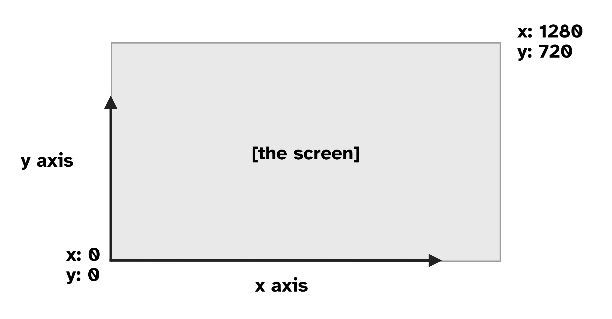
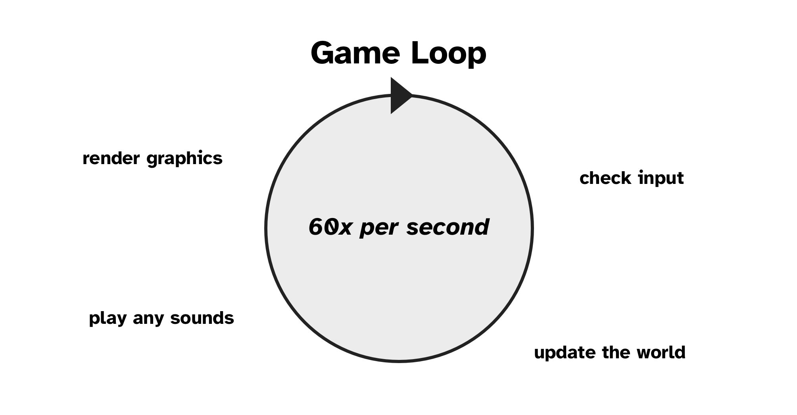

# Hello Dragon!

We'll start by rendering an image and some simple text on the screen. But first, we need to get our computer and DragonRuby Game Toolkit ready for developing games.

## First Steps

1. **Download a code editor:** Since you'll be coding your game, you need a special text editor to write the code without any extra formatting that text editors like Microsoft Word add. [Visual Studio Code](https://code.visualstudio.com/) is a great free editor. Download and install it. (Or use your own favorite editor.)
2. **Get DragonRuby GTK:** You need to get a copy of DragonRuby GTK so you can use the engine. [Buy it on itch.io and download the zip file for your operating system.](https://dragonruby.itch.io/dragonruby-gtk/purchase)
3. **Extract the DRGTK engine zip**: In your computer's file explorer, extract the engine zip file.

You're ready to work on your game. Let's get to it!

**ProTip:** don't delete the zip file! You can unzip it again when the time comes to start working on your next game. It's helpful to keep it around.

## What's in the Engine Zip

When you download DragonRuby Game Toolkit, it contains everything you need to build your game. There are no external dependencies to install or monkey with. You just use the provided files and start making your game.

Let's go over the key files in the archive you just extracted:

- `dragonruby` — the executable you'll run to launch your game in development mode, your primary entry into the development flow
- `dragonruby-publish` — a command-line tool to help you easily build and publish your game online, don't worry about this yet!
- `samples/` — a folder of example code that you can explore and run if you'd like, or just ignore for now
- `docs/` — the DragonRuby Game Toolkit docs for the version you've downloaded, extremely handy if you want to dive deeper than this book
- `mygame/` 🌟 — as the name implies, this is where the code, graphics, sound, and other assets live for your game; this is the primary folder you'll be working in
    - `app/` — this is where your Ruby code goes
      - `main.rb` — this is the main file for your game code, don't worry about the other two yet
    - `data/` — where you can put any data for your game, like level editor files
    - `fonts/` — where fonts go, duh!
    - `metadata/` — configuration files for your game, we'll do more here later
    - `sounds/` — where music and sound effects go
    - `sprites/` — where images go that will be rendered in the game; there are already some basic ones present

Don't worry about the other files yet. Focus on the `mygame/` directory, and, specifically, `mygame/app/main.rb`.

## Start the Game

Launch the `dragonruby` file.

If you're on macOS, right-click the file and select "Open". You'll need to ensure software from unverified sources can be run.

Here's what gets displayed:


This isn't a game... yet! But it is doing three key things:

1. Launching an app window
2. Rendering text
3. Displaying an image

And you haven't even written any code yet. Not a bad starting place.

DRGTK handles the boring stuff when it comes to making games—dealing with low-level APIs like graphics, sound, and the game window. We can instead focus on creating our game instead of, for example, figuring out how to save data in a way that's compatible with Linux, Mac, Windows, Android, iOS, and the web.

## An Overview of the Main Game File

Let's take a look at what's in `mygame/app/main.rb`:

``` ruby
{{#include code/chapter_01/01_default/app/main.rb}}
```

Open this file yourself in Visual Studio Code. Go ahead and do that: New Window > Open > [select the folder on your computer with the engine in it]

Six lines of code to render text and an image? Not bad! (Trust me, if you did this all from scratch without an engine, it'd take hundreds of lines of code.)

Here's what that code does, line by line:

``` ruby
{{#include code/chapter_01/01_default/app/main.rb:1}}
```

This `def`ines a method called `tick` and passes in a parameter called `args`. `args` is short for arguments and is provided to us by DragonRuby GTK.

Methods are reusable pieces of code that you can call to do something over and over again. Think of methods like verbs; they're actions. Methods are a foundational building block that allows for code reuse.

Let's say you wanted to give a friend a cookie 🍪, you'd define a method called `give_cookie` and pass in the `friend` as a parameter. The friend then has a method called `eat` that we call, passing in a parameter of cookie.

``` ruby
def give_cookie(friend)
  friend.eat("cookie")
end
```

You'd then call that method like:

``` ruby
francis = Friend.new
give_cookie(francis)
```

Note: methods in Ruby have optional parentheses. You can use them or leave them out when defining and calling your methods. These are the same:

``` ruby
def give_cookie(friend)
  friend.eat("cookie")
end

def give_cookie friend
  friend.eat "cookie"
end
```

I'm an agent of chaos and use _both_ styles throughout the book. Gotta keep ya' on your toes!

Wait, how'd we get talking about cookies and friends? Okay, back to the code above.

The next three lines handle outputting text to the screen:

``` ruby
{{#include code/chapter_01/01_default/app/main.rb:2:4}}
```

Your eyes might be melting a little bit. But don't worry, wipe that melted bit of eye away and focus! It's pretty intuitive once you get the hang of it.

Remember `args` from above? The parameter that's passed into `tick`? Well, you can call methods on it! This allows you to interact with the game engine.

`args` has a method called `outputs` that represents the data that gets rendered on the screen. You access it with `args.outputs`. Neato! `labels` is a method of `outputs`, see how the `.` chains things together?

The `<<` is called the shovel operator. It lets you push data into a collection. `labels` is the collection we're shoveling data into because we want to render some text.

And then finally the code within the brackets `[]` is an array of data that represents what we want to display on the screen. It may not be clear exactly what it's doing yet, but it'll become more clear over time.

I think of arrays like a stack of CDs. The CDs are in a specific order, but you don't know what a given CD is unless you pull one out of the stack and look at it. You have to do the same thing with an array. In programming, you put data into an array to collect that data and keep track of it. If you want to know what's at a specific place in an array, you have to check.

You can see some code in quotes, those are strings. And they're what's being displayed by the game. In order to show the text, though, we need to tell the engine where to place it on the screen. That's what the first two elements of the array do: they specify the `x` and `y` position of the text in the game. Then there's the text we want to render. That's followed by the text size. Then finally the alignment (centered in this case).

Here's it broken down:

``` ruby
#  x,   y,           text, size, alignment
[640, 500, 'Hello World!',    5,         1]
```

Don't worry about memorizing what the positional elements of the array mean. This is just a quick way to render text. We'll start using a more friendly approach soon enough. The sample game does this three times, thus rendering three different pieces of text. The `y` coordinate is different for each, stacking them on top of each other vertically instead of overlapping one another.

Gosh enough of this rambling, let's adjust some code. Change the text from `"Hello World!"` to `"Hello Dragon!"` and save the file.


Did you see that? The game reloaded your code and changed the text to "Hello Dragon!" That was quick, wasn't it? That's one of the best parts of DRGTK—live reloading of your game code in the engine. This allows you to make changes to your game quickly, reducing the time between the cycles of writing your code and testing it.


``` ruby
{{#include code/chapter_01/01_default/app/main.rb:5}}
```

`args.outputs.sprites` is like `args.outputs.labels`, but instead of holding labels, it's a collection of sprites. It renders the `"dragonruby.png"` image at x: 576, y: 280, just like label text, and it also sets the size of the image to display. That's what the `128` and `101` represent in the array. Here's a breakdown of those elements:

``` ruby
#  x,   y,   w,   h,            image
[576, 280, 128, 101, 'dragonruby.png']
```

Just like with labels, don't worry about memorizing the order here. There are friendlier ways to use them that we'll get to shortly. But it's an easy enough bit of code for putting an image on the screen.

Finally, the last line:

``` ruby
{{#include code/chapter_01/01_default/app/main.rb:6}}
```

signifies that the definition of the `tick` method is over. Any code after that isn't part of the `tick` method. That's it for what we get out of the box.

## Screen Coordinates Explained

Let's take a detour down Screen Coordinates Road. The `x` and `y` values are coordinates on the two-dimensional plane of the game window. Remember geometry? I barely do. But this is important, so don't doze off on me yet. We're only still in the first chapter!



DRGTK games are made up of a window that's 1280x720 pixels in size. That's 1280 pixels wide and 720 pixels tall. The rectangle of the game screen contains 921600 pixels, that's those two numbers multiplied. Each of those pixels has a coordinate on the plane. It makes it easy to refer to a specific pixel by using its `x` and `y` position.

DRGTK starts 0, 0 in the lower left. So 1280, 720 would be the upper right. **Note:** This varies from most game engines, libraries, and tools, but it's intentional to make it easier to think about gravity and follows the geometric 2D plane that is taught in mathematics.

It's important to keep coordinates in mind, as we'll be using them a lot when making our game. A major aspect of games is moving things around on the screen, which we do by changing their coordinates.

## Our Own Hello

Back to making the game. Okay, yeah, you changed a string and it changed what was displayed. That's neat. But let's hit reset and do it ourselves.

I want you to delete the code in `mygame/app/main.rb`. Select it all and delete it. Yup, I know, the blank canvas is a challenge. But you need to start writing the code yourself in order to learn. So go ahead and type out each line below into your `main.rb`.

``` ruby
def tick args
  args.outputs.labels << [120, 120, "Hello Dragon!"]
end
```

You know what that does, right? Well, you saw it automatically reload in your game, so of course, you do!

Let's greet our friend Oboe too.

``` ruby
def tick args
  args.outputs.labels << [120, 120, "Hello Dragon!"]
  args.outputs.labels << [120, 100, "Hello Oboe!"]
end
```

Wow, so many friends we're saying hello to! The thing is... that code is a bit... duplicative. Let's write our own method to clean that up:

``` ruby
def greet friend
  "Hello #{friend}!"
end

def tick args
  args.outputs.labels << [120, 120, greet("Dragon")]
  args.outputs.labels << [120, 100, greet("Oboe")]
end
```

The new code refactors (changes the implementation of the code without changing the behavior) the original so that we can easily change the greeting in one place instead of many. This is a bit of a trivial example, but it shows how we can write our own methods in DRGTK to make our code better. Reusing code is fundamental for the rest of this book.

The `"Hello #{friend}!"` code does what's called string interpolation. It takes whatever `friend` is, hopefully a name as a string, and inserts it. It's pretty similar to this code: `"Hello " + friend + "!"`, but quite a bit friendlier to use. The `#{}` tells Ruby to run any Ruby code within those curly braces.

Methods in Ruby return a value. Return values can then be used by the caller for whatever purposes are needed. In the example above, the return value is the string we built. Ruby returns the value of the last line of the method definition automatically. But you can explicitly return early with `return`, which can be useful if you want to end the execution of a method early.

Go ahead and change the `greet` method to:

``` ruby
def greet friend
  "Hello #{friend}!"
  1
end
```

Whoa! What happened to our greetings? Well, we changed our code and it now always returns `1`, which isn't what we want. It's just an example to illustrate how that works. Go ahead and undo that change.

Let's wrap up this chapter by displaying a sprite. In `mygame/sprites/misc/` there's a file named `dragon-0.png`. It's a pixel art dragon made by Nick Culbertson that's free to use. Pretty neat. Thanks, Nick!

``` ruby
{{#include code/chapter_01/02_our_own_hello/app/main.rb}}
```


That's some pretty fine code for the first chapter. We've got text and an image displaying. We learned about methods too. Don't worry if it's not all making total and complete sense. You'll understand more with time. Remember, be patient with yourself.

## Game Loop Explained

There's a lot of magic that comes from DragonRuby Game Toolkit, where we can just write `def tick` and magically have a game. What's happening is that DragonRuby Game Toolkit takes the code in `mygame/app/main.rb`, finds the `tick` method, and then runs a loop that calls it 60 times every second until the program closes. This loop is referred to as the Game Loop.

When programming games, any number of things are happening at one time. Enemies are moving, images are being displayed, math is being calculated, input is being handled, etc. The loop runs over and over again, accounting for any changes in the state of the game. This is similar to how screens on devices work—they refresh so many times a second, so fast that it's barely perceptible to the human eye.

Within the game loop, we'll keep track of everything that's happening, update state, and render text and images. It's important to begin to think about things in a loop, as it influences timing and code structure.



The game loop will begin to feel more natural over time, but for now, remember this: **DRGTK runs the `tick` method 60 times every second**.

If you're familiar with games, you may know about frames per second (FPS). That's how many frames are rendered in a given second. 60 FPS is known for its smoothness and is often a target of many games. In DragonRuby GTK, the 60 ticks per second can be thought of as the same as your game running 60 frames per second (FPS).

## What's Next

Let's get the player dragon moving around on the screen when we press certain keys. Player input is foundational to making games and a great next step.
