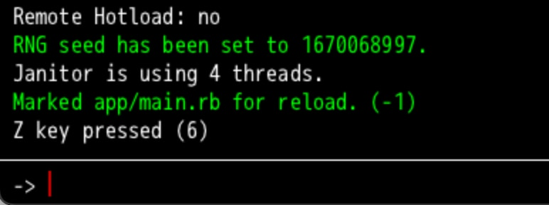
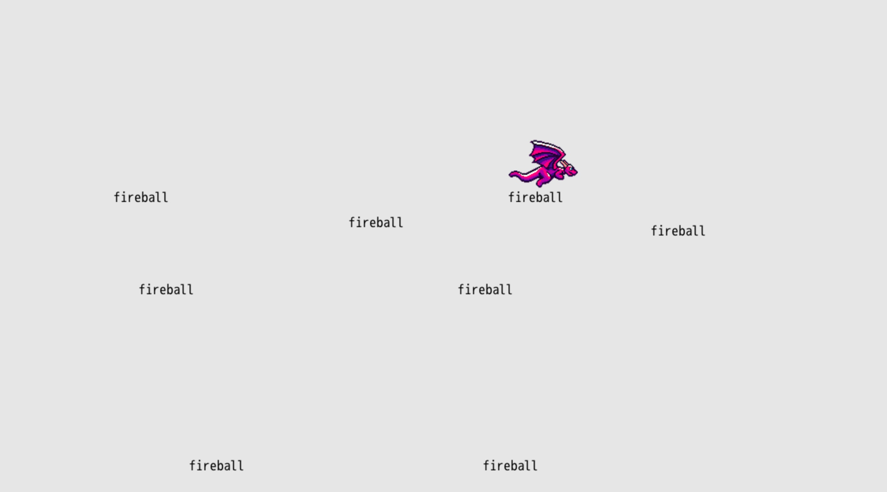
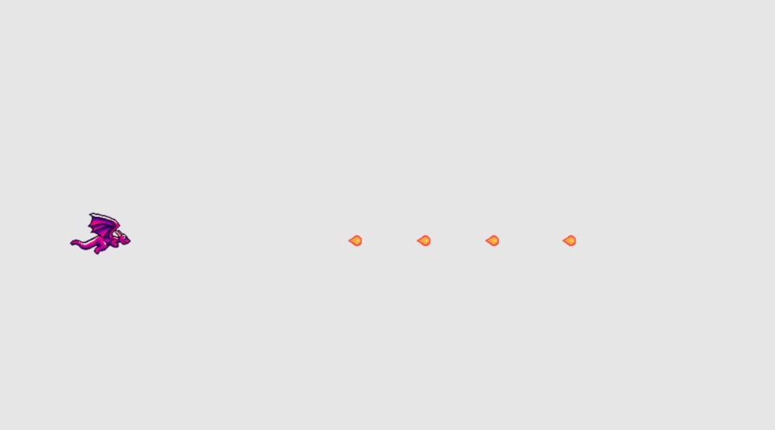

# Spit Fire

Our next mission is to make our dragon spit fire because that's just what they do. We'll piece this whole thing into a game soon enough. But let's keep focusing on simple mechanics and the code for right now.

## Fire on Input

In the last chapter, we used `args.inputs` to check for player input from the four main directions. If those inputs are pressed, then we move the dragon. Now let's check to see if the <kbd>Z</kbd> key is pressed to know when to have our dragon spit a fireball.

To check if a key was pressed, we can use `args.inputs.keyboard.key_down` and then whatever key we want to check. So in our case, we'll check `args.inputs.keyboard.key_down.z`. In our `#tick` method, right above where we render the dragon sprite, let's check for that input:

``` ruby
{{#include code/chapter_03/01_input/app/main.rb:36:40}}
```

Using `puts` is a really helpful way to check that our game works as we expect it to. In this case, every tick where the <kbd>Z</kbd> key is pressed down, it prints the string "Z key pressed" to the console (open it with <kbd>~</kbd>, remember?). Run your game and press the <kbd>Z</kbd> key a bunch and then open your console.



## Expanded Control Support

When making a game, it's important to support a variety of input configurations to make the game as accessible as possible. Sure, the keyboard arrow keys and the <kbd>Z</kbd> key are sensible defaults. But what if our player wants to use a gamepad controller? Or what if they would prefer to use WASD for movement? From the start of coding player input, let's support as many different inputs as reasonably possible.

In our case, we'll support three configurations:

- Arrow keys and <kbd>Z</kbd>
- WASD and <kbd>J</kbd>
- Gamepad

DragonRuby GTK is a big help in this department. Our code earlier that checks `args.inputs.up` (down/left/right) already checks for the arrow keys, WASD, and gamepad input. Slick! We don't have to change anything there. But let's go ahead and update our logic check for firing the fireball to check all of the possible inputs.

``` ruby
{{#include code/chapter_03/02_input_expanded/app/main.rb:36:40}}
```

We learned about `||=` earlier, and that's a combination of two separate operators in Ruby. `||` represents "or" and `=` says to assign a value. If the value on the left doesn't have a value, assign it the value on the right. We can make use of the "or" (`||`) operator independently of the assignment operator (`=`) to control the logic within our game.

The code above says: if the <kbd>Z</kbd> key is down OR the <kbd>J</kbd> key is down OR the A button on the gamepad is pressed, then output the string to the console.

You can combine `||` on one line (`if monday || tuesday || wednesday`), but it can be helpful to break long lines to make our code easier to read.

Outputting info to the console isn't that helpful for the player, but can you begin to imagine how we'll use that check to instead spit a fireball.

## Displaying Fireballs

We want to display a fireball on the screen when the action key is pressed. We've got most of the code, all we need to do is change `puts` to instead display the fireball.

At the top of `#tick` (`#name` is Ruby shorthand for "the `name` method"), assign an empty array to `args.state.fireballs` if nothing has been assigned yet. This will let us keep track of fireballs across the game loop to do all sorts of things with them (display them, move them, collide them with other objects):

``` ruby
{{#include code/chapter_03/03_displaying_fireballs/app/main.rb:1:4}}
```

Then where we check for the action input, push a fireball into the `arg.state.fireballs` array based on the current player's x and y position:

``` ruby
{{#include code/chapter_03/03_displaying_fireballs/app/main.rb:38:45}}
```

All we have to do is render our fireballs by pushing them into the `args.outputs.labels` collection. DragonRuby is smart enough to know that if we push an array into any `args.outputs` collection it'll flatten it and display them correctly. Thanks, DragonRuby!

We use arrays to represent various data in our game like labels and sprites, but we can create our own arrays to keep track of the data in our game. Arrays are a great way to collect data that we then use throughout our game. In this case, we're maintaining a collection of fireballs.

Play your game and see what happens! Fireballs everywhere. Wait! You're not impressed by those fireballs? I'd be pretty frightened if the word "fireball" was flying at me.



Wait, where are you going? Why are you muttering "I didn't sign up to read no stinkin' book where you output the word 'fireball' on the screen, I'm here for the real flame, the good stuff..."

## Moving Fireballs

Guess what? We're sticking with ole "fireball" for now! It's silly and fun and I haven't found a good fireball sprite to use. We'll get there, we'll get there. But let's first make the fireballs move across the screen.

When we moved our player dragon, we took the x and y position and added or subtracted values in each `#tick` based upon if any directional input was pressed. Our fireballs will move regardless of any button pressed once they're extruded from our dragon's mouth. Because our game is simple and the dragon only faces to the right, all of the fireballs will move to the right. How do we go about that on our X-Y axis? We just increase the `x` position of the fireball each tick. Let's do that and see what happens:

``` ruby
{{#include code/chapter_03/04_moving_fireballs/app/main.rb:38:48}}
```

Right between where we add a new fireball to `args.state.fireballs` and we display them using `args.outputs.labels`, our new code does this:

1. Loops through the array of `args.state.fireballs`
2. For each fireball, updates the array value at the `0` index, which is the x position of the fireball, to be the dragon's speed plus 2 (because we want the fireball to move faster than the dragon).

Move your dragon around, spit some fire, and bask in the glory of a word moving so smoothly across the screen that it almost looks like a... fireball!

Try changing around `speed + 2` to make the fireballs move faster or slower and see how that feels. Adjusting speed values can really change the vibe of your game and is important in tuning it to feel just right.

There are a lot of important concepts in those three newly added lines of code. In Ruby, when there's an array of data, we can loop through **each** item and modify their properties. Games are composed of huge collections of things: enemies, fireballs, menu options, player inventory. Arrays (and just collections in general) aren't anything to be afraid of, and soon enough, you'll be naturally thinking of your game data in terms of arrays.

Looping through an array of data in each `#tick` and then doing _something_ is the stuff games are made of! Here are some ways this can be applied in all sorts of games: enemy behavior, checking for collision, animating. As our game (and any game you make) gets more complex, looping through collections of data becomes more and more common.

## Switching to Hashes

So far throughout the book we've been using arrays to represent the entities in our game, whether it be the player's dragon sprite or our fireball text that gets displayed. Remember `[args.state.player_x, args.state.player_y, 'fireball']`? Arrays are wonderful and important, but they aren't so great for representing structured data because it's difficult to remember what each piece of data in the array's positions represents. Remembering that `fireball[2]` is the text value and not the y value is tricky. Luckily, DragonRuby has a more verbose and clear data structure we can use for managing our data. It's called a hash! Much like arrays, hashes are extremely useful.

Let's look at what the text example above would be like as a hash:

``` ruby
{
  x: args.state.player_x,
  y: args.state.player_y,
  text: "fireball",
}
```

Hashes are expressed through curly braces `{}` and contain `key: value` pairs separated by commas. The values of a hash can be anything, from numbers to strings to whatever your heart desires. Let's say we wanted to build our own hash to represent a dragon and put it in the `dragon` variable:

``` ruby
dragon = {
  name: "Francis",
  size: "medium",
  age: 541,
}
```

Values of a hash are then accessed by their keys, so `dragon.name` returns the string `"Francis"`, `dragon.size` returns the string `"medium"`, and `dragon.age` returns the number `541`. This is much more clear than having to remember the position of these values within an array.

Quick note: if you see a hash with key-value pairs that look like this: `{ :name => "Francis" }`, don't fret! That's just an another style in Ruby known as the hash rocket.

In general, differentiate between arrays and hashes like this: **hashes are used represent one piece of data with multiple properties** and **arrays are used to collect data (often times hashes) to keep track of and manipulate them**.

Below is our entire game translated to use hashes instead of arrays for our rendering:

``` ruby
{{#include code/chapter_03/05_switching_to_hashes/app/main.rb}}
```

It may not seem like much has changed, but there are two key changes that make this worthwhile:

1. `fireball.x += args.state.player.speed + 2` — it is much clearer when we move the fireball that we're adding to its `x` position AND using the player's speed
2. `args.outputs.sprites << args.state.player` — because we're keeping track of our player in `args.state.player` and it has the data DragonRuby needs to render it, we can just push it into `args.outputs.sprites` and not construct the array that we used to use

## Displaying a Sprite

With that refactor done, let's display a sprite for our fireball and call it a chapter.

Download the fireball sprite below and put it in `mygame/sprites/fireball.png`:


I just made that! It's not half bad, right?

We'll change the hash we push into `args.state.fireballs` to be a sprite and adjust how we render that collection. Nothing too major. Here are the changes near the bottom of `#tick` that you'll need to make:

``` ruby
{{#include code/chapter_03/06_sprite/app/main.rb:40:56}}
```

We adjust the starting place of the fireball sprite to look like it comes out of the dragon's mouth. The sprite is 32 pixels wide by 32 pixels tall, so we set that.

Now that the fireball is a sprite and not a text label, we can push both the player and the array of fireballs into `args.outputs.sprites` in one go. This is more efficient for DragonRuby than doing it separately.



## What's Next

We're so close to having a game, so close! We just need something to spit fireballs at, right? In the next chapter, we'll display some floating targets that get destroyed when a fireball hits one.
