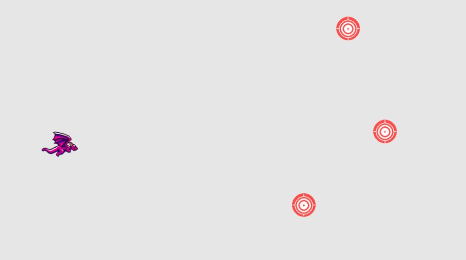
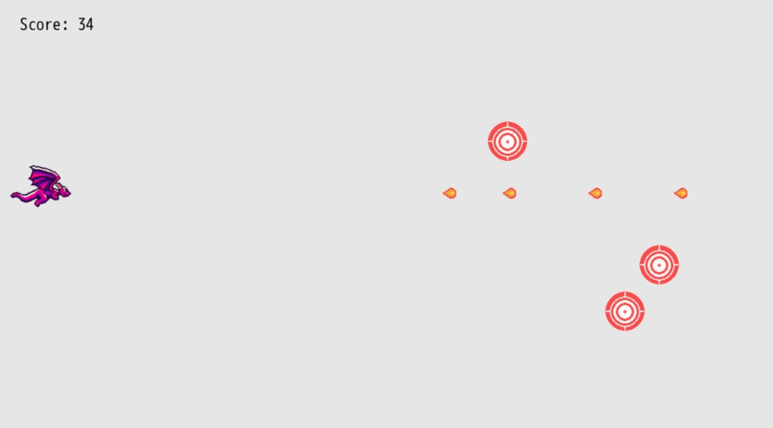

# Target Practice

For a dragon to gain accuracy in the fine art of breathing fire, they need to practice, right? Let's build out a feature where targets randomly spawn for our fireballs to collide with. We'll keep track of how many targets we've hit and use that as the main scoring component of our game.

## Displaying Targets

First, let's download the target sprite and put it in `mygame/sprites/target.png`:


We'll keep track of the targets in an array, just like fireballs, so that we can more easily manage them throughout our game loop. Instead of initializing our targets as an empty array, let's start by displaying three of them:

``` ruby
{{#include code/chapter_04/01_display_targets/app/main.rb:10:33}}
```

We need to render our target sprites too, so include those in the array we push into `args.outputs.sprites`:

``` ruby
{{#include code/chapter_04/01_display_targets/app/main.rb:79}}
```

Similar to how we represent the player and fireball sprites, the targets have x and y coordinates for position, width and height for size, and an image file to represent the sprite. We create three items in our `args.state.targets` array, which then displays three different targets.



Try changing the `x` and `y` positions of our three targets. Weird. They don't change their position...

If you quit your game and relaunch `dragonruby`, they will though. Why is that?

Well, when DragonRuby loads our game code, if any value is set in `args.state` via `||=`, it won't reassign the new value because that value is already set. `args.state.targets` already has three targets in it, so when our code is reloaded, it doesn't know to discard our old targets.

Let's instruct DragonRuby to reset our state when the game runs by adding the special `$gtk.reset` after the `end` of `#tick`:

``` ruby
{{#include code/chapter_04/01_display_targets/app/main.rb:79:82}}
```

Now if we change the coordinates of our target, the game reloads our code and they change their position. This is a really awesome aspect of DragonRuby. We can easily adjust and modify the running game without having to restart the engine.

## Our First Method

There's something that's a bit of a bummer about our target array code. We duplicate a lot of values by having to specify the width, height, and image path. It'd be a bit annoying to have to change it in all those places even though we want them to be the same. Let's introduce a method to make this code better. Methods are great for encapsulating a specific action. In our case, let's define a method that creates a target at a given x and y position.

``` ruby
{{#include code/chapter_04/02_target_method/app/main.rb:1:25}}
```

Within `mygame/app/main.rb` we can define methods that are able to be called in `#tick` and our other code. Our new `spawn_target` method takes two parameters, the x and the y position, and then uses those parameters to return a hash representing the new target. In Ruby, method parameters are separated by commas. We pass parameters into methods that we want to have access to within that code. Because the width, height, and image don't change for a given target, those values stay the same and aren't passed in as parameters.

Then when we lazily assign `args.state.targets ||=`, we call the method three times, passing in the coordinates we want the target to spawn at.

`#spawn_target` is a simple method, but we'll begin to see how we can expand upon the methods we write to make our code easy to understand while it gets more complex.

## Collision Detection

The fireballs our dragon spits just fly behind our targets and off the screen into infinity. Let's make it so that if a fireball hits a target, _something_ happens. Eventually, we'll want to play a sound, remove the target, and even play an animation. But humble beginnings, humble beginnings.

Collision detection is when one object overlaps with another object in our game. Because we're manufacturing the space the game exists in, there's no physics like we have in real life. We need to simulate that by checking to see if two objects are attempting to exist at the same point and react accordingly.

Our fireball sprite is a 32x32 square, so we want to check in every single game loop whether or not the points of the fireball's square overlapping with any of the points of the target sprites. If they are overlapping, then we do that _something_.


We could employ trigonometry to determine if a given point in one shape overlaps with another, but DragonRuby gives us a helpful method to handle this for us: `args.geometry.intersect_rect? rect_1, rect_2`

It may seem odd that we're checking the intersection of two rectangles when our target is a circle and our fireball is almost a circle. Most 2D games use rectangles for their collision detection for the simplicity of it. Our images are already rectangles, and it's close enough for our purposes.

Here's the written out logic behind the collision detection we'll implement:

- In each `#tick`, keep our code for looping through and moving each fireball
- After we move a fireball, loop through each target and check if the fireball is overlapping any of them
- If they do overlap, output a message to the console

``` ruby
{{#include code/chapter_04/03_collision_detection/app/main.rb:67:75}}
```

Play the game and hit some targets. Nothing visually happens (yet), but if you check the console (<kbd>~</kbd>), you'll see that `"fireball hit target"` was output multiple times.

With a loop and a method, we've implemented collision detection. That wasn't too bad, was it?

## Remove Targets On Collision

But... It's not very helpful to output a message to the console when a target is hit. Let's instead remove the target so that it is no longer displayed. We'll need to remove the hit target from the array of targets so that it's no longer checked against.

We'll go about this in the following way:

- If a target should be removed, then we'll mark it as `dead`
- After we've checked all of our targets, we'll `reject!` the dead ones from `args.state.targets`

Ruby makes that pretty easy. All you do is call the `#reject!` method on an array and pass in the logic for when an item should be removed. If you have an array of numbers and call reject on all of the numbers, only the odd ones will remain in the array:

``` ruby
nums = [3, 4, 5]
nums.reject! { |n| n.even? }
nums # => [3, 5]
```

In the code above, `n` is the argument passed into the block, which represents a given number in the array. `#reject!` loops through each element in the array, checking each element against the code we've written.

So in our collision detection code where we call `puts`, we'll instead mark the target and fireball as dead _and_ then reject the dead ones from their collections:

``` ruby
{{#include code/chapter_04/04_remove_targets/app/main.rb:67:79}}
```

Since the target and fireball that collided are no longer being tracked in `args.state`, they don't get rendered on the screen and are, for all intents and purposes, gone! We then `#reject!` each fireball and target that is `dead`.

This almost feels like a game. That's a great feeling. We're getting close to _fun_.

## Spawn New Targets

Shooting three targets and having them disappear doesn't make for much fun though. After the three targets are hit, it's just your dragon floating in the sky with not much else to do. We're back to chapter 3! Ugh, chapter 3 was so boring! I can't believe we ever even made anything that boring before. (But remember how cool it was when we got the fireballs working? That was cool! It's funny how a game evolves and what it used to be, seems so basic compared to where we're at now.)

Remember back in the day, way back when, like a few sections ago, when we introduced `#spawn_target`? It was helpful then, but now it's going to be even more helpful. We'll call it every time we destroy a target so that a new one spawns. We'll be able to play _Target Practice_ forever!

But calling `#spawn_target` with the same x and y over and over isn't a lot of fun. So let's make a few related changes where we'll do the following:

1. Determine a random x and y position on the screen to spawn the target
2. Remove the x and y for our initial three targets so they get a random position
3. Spawn a new target in a random position when we hit one


### Spawn at a random location

``` ruby
{{#include code/chapter_04/05_spawn_new_targets/app/main.rb:1:10}}
```

`#spawn_target` looks a little different now. We no longer pass in the coordinates as arguments because we'll randomly generate the position. We instead pass in `args` from DragonRuby's `#tick` so that we can get the width and height of the screen to use to determine boundaries.

We create a `size` variable to store the width and height of the sprite to use in our formulas for spawning the target. We don't want to have to type 64 over and over because it loses its meaning and gets difficult to change.

Then we apply some math. Don't let math scare you away from programming! We'll keep it simple and the toolbox you need is relatively small. Plus, the math will help make our game even better. Games make math fun.

`rand` is a method that we get from DragonRuby that's available everywhere. `rand` without any parameter generates a random real number between 0 and 1. That's not really useful for us right now, so we can instead pass in a parameter that sets the upper boundary of the random number. `rand(100)` generates a random integer from 0 up to 100 (not including 100).

So for the x position of the target, we generate a random number that's up to two-fifths the width of the game screen and then we add three-fifths of the width to that number so that the targets spawn on the far right side of the screen. We don't want to spawn targets too close to the player, otherwise our game will be too easy.

For the y position, we generate a random y position based on the height of the game, but we subtract twice the size of the target sprite and then add one of its sizes back to the random number to give the spawn area a gutter. This prevents the target from spawning partially off the screen, which would make it impossible to hit.

### Change the initial three targets

``` ruby
{{#include code/chapter_04/05_spawn_new_targets/app/main.rb:22:24}}
```

Instead of passing in the x and y position, we just call `#spawn_target` with DragonRuby's `args` so that we have access to the grid in our method. This gives us three randomly located targets.

### Spawn a new target when one is hit

``` ruby
{{#include code/chapter_04/05_spawn_new_targets/app/main.rb:66:76}}
```

We loop through the fireballs and move each one, just as before. And then we check to see if it intersects with any of the targets. If they do intersect, we mark both the fireball and the target as being hit.

The one new line is where we push a new target into `args.state.targets` from `#spawn_target`. That'll make a new target appear in a random location whenever we hit another.

Play the game a bit and see how feels. Is there anything that can be adjusted or improved? What if you adjust the formula for `#spawn_target`? How does that feel with targets spawning close or further away?

## Score Tracking

Let's keep track of how many targets we've destroyed before we call it a chapter.

The approach for this is pretty simple. We'll store a number in `args.state.score` and increase it each time we hit a target. Then we'll display that number on the screen as a label.

Near the top of `#tick`, lazily initialize `args.state.score` to `0`.

``` ruby
{{#include code/chapter_04/06_score_tracking/app/main.rb:21:27}}
```

In our collision detection loop, when we hit the target and fireball, add `1` to our score:

``` ruby
{{#include code/chapter_04/06_score_tracking/app/main.rb:72:75}}
```

Finally, display our score as a label in the upper-left area of the screen:

``` ruby
{{#include code/chapter_04/06_score_tracking/app/main.rb:83:89}}
```

This approach to displaying a label is different than previous chapters. Instead of using an array to represent the properties of the label, we're now using a hash like we do for sprites (for similar reasons: it's easier to remember and more clear). Setting `x`, `y`, and `text` should be familiar by this point. But `size_enum` is new. It's a way to specify how large the text is. It takes whatever value we set and adds that much to the default text size. Increase it from `4` to `40` or `-3` and see what you like best.



## Summary

What a chapter! We displayed targets, handled collision detection, spawned our targets randomly, and added score tracking. We've come a long way in this chapter. And added a lot of core concepts that are found in most games. Review the code to make sure you understand it.

## Extra Credit

- There's a chance that our randomly generated targets can spawn on top of each other. How can you make it so that doesn't happen?
- How could you change the collision detection to check if two circles overlap instead of rectangles?
- We added gutters for the y position of our targets in `#spawn_target` for the top and bottom of the game screen, but how would you add a gutter for the x position so they don't spawn partially off the screen on the right side?

## What's Next

We'll take a brief side quest where we ask some big existential questions and clean up our fireballs that have flown off the screen before we turn this project we've been working on into a game that we can play and finish.
