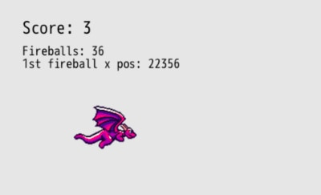

# Fireball Clean Up

Time for a little side quest from the progress we've been making to clean up a small mess we've been making and learn a bit about performance optimizations.

As you've been shooting fireballs, have you wondered at all about what happens to all of those fireballs that fly off the right side of the screen?

Do you think they just... keep flying forever? Or do you think they just disappear from our game and our lives?

What if I told you that they don't disappear!

Whoa.

We could shoot thousands of fireballs that don't hit a target and our game is keeping track of them and updating their position over time. Let's demonstrate that.

## Tracking Offscreen Fireballs

DragonRuby gives us `args.outputs.debug`, which allows us to display shapes, labels, sprites, and more only when we're making our game. If we built it for release, the debug outputs wouldn't be displayed. Pretty nifty and really helpful for visually displaying information in each frame of our game.

Add these lines to the bottom of `#tick` after pushing our score text into `args.outputs.labels`:

``` ruby
{{#include code/chapter_05/01_tracking_offscreen/app/main.rb:91:100}}
```

It displays two pieces of text in our game (but remember, only in debug mode). The total number of fireballs our game is keeping track of and the x position of the first fireball. The ampersand in front of `args.state.fireballs.first&.x` says: if there's a first fireball, try to get its x property, otherwise don't throw an error. If we haven't hit the fire button, there's no first fireball in our array to get the `x` value of.



Spit a bunch of fireballs out and let your game run. You'll see the dozens of fireballs just keep going on and on forever, their x position steadily increasing.

## Optimizing Our Game

It's not very efficient to keep track of and update the position of fireballs that have no chance of ever hitting a target when they've gone off the screen. There could be thousands of fireballs, and sure, maybe our game still runs smoothly while we're testing, but there's a high chance that as our game gets more complex, there the sheer amount of data the game needs to process 60 times every second could get overwhelming and slow things down.

When making games, you need to be cognizant of performance. There are usually some straightforward fixes that can make a big difference.

In the case of our game, let's reject fireballs from our `args.state.fireballs` array when they fly off the screen. This will reduce the amount of processing load our game needs to handle.

``` ruby
{{#include code/chapter_05/02_optimizing/app/main.rb:67:86}}
```

When looping through `args.state.fireballs`, we check to see if the x position of the fireball in the loop is greater than the width of the screen. If it is, then we mark the fireball as `dead`, just like we do below on collision with a target. Then we call `next`, which tells the loop we're in to move on to the next fireball in the array and not the rest of the code in this iteration of the loop. Since we've removed the fireball from the game, we don't want to check it for collision.

Play your game and see that now as the fireballs fly off the screen, the total number of fireballs decreases. They no longer exist forever, flying off across the sky for all eternity, eating up our CPU cycles.

Feel free to remove the `args.outputs.debug` lines if you don't want to see them since they've served their purpose and are less useful now.

## Summary

There will be many opportunities when working on your games to optimize your code so that it performs better. This was just a taste of what that process can be like. As you get better and better at making games, you'll improve at making them more performant.

Don't obsesses over performance too much yet though. Focus on making your game fun to play.

## What's Next

Now that we've cleaned up a small mess we've been making, let's get back to taking our game to the finish line by adding a timer to our game to see how many targets we can hit in 30 seconds.
