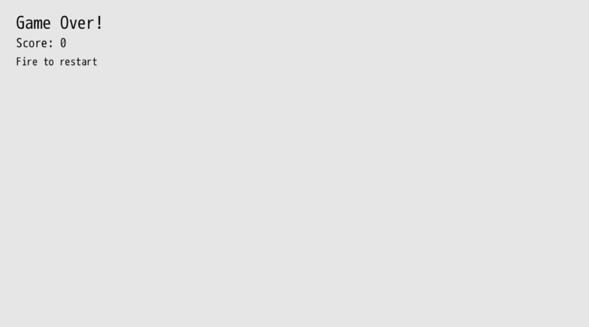
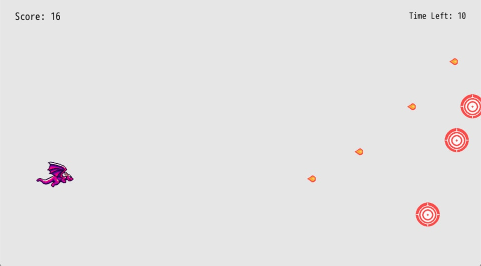

# Time Attack

We've _almost_ got a game. But we need some way for the game to end. A lot of game loops end with the player's character dying, where they respawn or start over again. Other game loops end when the player reaches the end of a level.

For our simple game, let's add a 30 second timer that counts down. The objective of our game will be to see how many targets can the player hit in that time window. Let's call our game **Target Practice**. Every dragon needs some practice before they head out into battle, right?

Adding a timer to our game introduces a few new concepts we'll build out in this chapter:

1. Keeping track of time and displaying it
2. Stopping our game when the timer runs out
3. Displaying a Game Over screen with the score
4. Allowing the player to restart the game and play again

## Getting It Working

We'll start by introducing `args.state.timer` that will be used to keep track of how much time remains.

``` ruby
{{#include code/chapter_06/01_time_attack/app/main.rb:25:28}}
```

We lazily set it to `30 * 60`. We want the game to last thirty seconds and our `#tick` method runs sixty times every second, so we multiple them together to get the total number of ticks our timer will run for. We'll then subtract one from `args.state.timer` every `#tick` so that it decreases as we play our game.

Right below decreasing our `args.state.timer` by one, we check to see if the timer is less than zero. If it is, that means game over.

``` ruby
{{#include code/chapter_06/01_time_attack/app/main.rb:28:59}}
```
If it is game over, then we let the player know, display their final score, and tell them how to play again (by pressing the fire button). We make an array of labels which we then push into `args.outputs.labels` to efficiently render them all.

If any of our fire keys are pressed, the game is reset with `$gtk.reset` and the player can play again.

The `return` line is _really_ important. It says, return out of the `#tick` method so that none of the code below runs. We don't want to have the dragon be moveable or for targets to spawn when it's game over. So we eject early and only display the game over screen details.



Way at the bottom of `#tick`, let's display a label with the time remaining:

``` ruby
{{#include code/chapter_06/01_time_attack/app/main.rb:121:135}}
```

We use the same pattern of creating a `labels` array, pushing in the player's score and the time remaining. In order to get the time remaining, we divide it by 60 and round. We do the opposite of what we did when we set the total time in ticks.

The `alignment_enum` let's us specify that we want the text to be right aligned instead of the default left alignment. This let's us nicely position our timer in the upper right corner of the game.



We've got ourselves a game that we can start, finish, and replay. Isn't that pretty awesome?

## Restart Grace Period

If you happen to press the fire button right when the timer runs out, you may restart your game without even seeing the game over screen. Let's add a little grace period between when the game is over and when we start accepting input to restart. 30 frames should be plenty and it won't even be noticeable to the player.

``` ruby
{{#include code/chapter_06/02_restart_grace_period/app/main.rb:52:57}}
```

Beause we keep subtracting from `args.state.timer`, we can check to see if the current value is less than -30. If it is, then we'll accept input to restart the game.

`&&` (double ampersand, often read as "and-and") means that both sides of the express must be true for the code within the conditional to happen. In our new restart check, we combine AND and OR by saying: if the game timer is less than -30 AND any of our fire keys are down, then we reset the game. When you group together expressions in parentheses, `(monday? || tuesday?)`, it evaluates them as one express against the other checks. We care about the timer being below a certain amount AND any of the inputs beingpressed.

Combining logic in this way for flow control is very common when making games. `&&` and `||` are pretty common operators in most programming languages.

## Refactor

Our main `#tick` method is getting a bit long in the tooth, being over 100 lines long. We've also duplicated two things: frames per second with the `60` value and checking for fire input. This is a good opportunity to refactor our code once again to make it easier to work with. Let's break up `#tick` into a series of smaller methods that we call from within it. Encapsulating our logic into smaller pieces makes it easier to work on those smaller pieces without concerning ourselves with the rest of the code.

How small should you make your methods? That's up to you. Use your best judgement and do what feels right. Code can change and grow quite organically. Once something feels too big or complex or is duplicated, improve it. Don't over-engineer your game right from the start, otherwise you'll be off in the weeds and not actually making your game fun. On the other hand, if you just neglect your code, you'll make it more difficult to change, thus slowing down the development process. There's a fine line between over-engineering and creating a mess.

Here's the entire game broken down into some smaller methods to make it easier to work with moving forward:

``` ruby
{{#include code/chapter_06/03_refactor/app/main.rb}}
```

Because so much has changed and shifted around, I'll just walkthrough the main changes:

- `FPS` is a constant, which is a special value in Ruby that doesn't change. We assign it to `60` because our game runs at sixty (f)rames (p)er (s)econd. That value won't change, but it's more helpful in our math code to see `FPS` rather than `60` because we now know what that value represents.
- `#fire_input?` checks to see if any of our keys are down for firing a fireball. By using our method, we can easily adjust it without having to change it for both restarting the game and the dragon spitting the fireball.
- `#handle_player_movement` does just what it describes. That code has a lot of checks but we haven't changed much, so let's put it in a method to get it out of the way.
- `#game_over_tick` is our own special method for when it's game over that gets called from our main `#tick`. It makes it easier to refer to and change what happens when our game is over.


I hear you over there screaming, "You expect me to rewrite the entire game line-by-line?!?! I quit!" It's okay to copy and paste what's provided above into your game. If you've made some adjustments, make them again. This refactored code is going to be the foundation for the rest of the book.

## What's Next

We've got a working game, but it's a bit... boring. Let's polish our game up by adding high-score tracking, sounds, animations, and more. We've got a working core of a fun game, and now it's time to make it a great experience.
