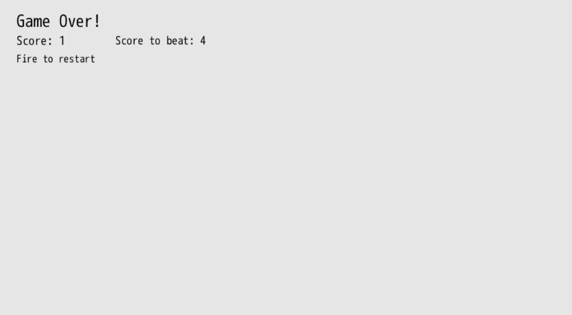
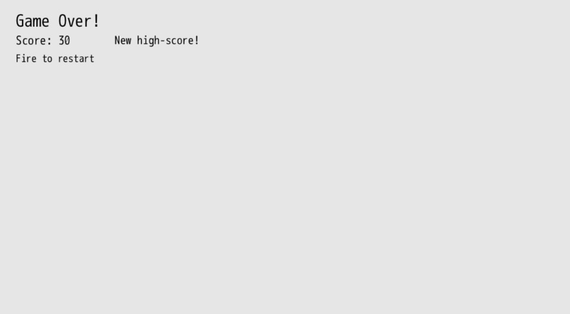

# High-Score

Saving and loading data is a key piece of functionality when it comes to making games. We may want to keep track of all sorts of important data across play sessions. For _Target Practice_, let's keep it simple and track the high score each time a new one is set.

## Load & Save Data

When the game is over, let's display whether or not a new high score was achieved. If it is higher than the previous one, we'll save that new high score. Otherwise, we'll display the high score and encourage the player to try to beat it.

This will require two parts:

1. Saving the score when a new high score is achieved
2. Loading the previous high score to compare the player's score to

DragonRuby GTK gives us two handy methods to do so:

- `args.gtk.write_file("high-score.txt")`
- `args.gtk.read_file("high-score.txt")`

Save data, especially for our game, can be as simple as a text file on the computer. While this may allow for save tampering, that's not something we're too worried about for our game. The foundations of writing our data to a file and loading it apply no matter how complex our game data persistent needs get.

We'll be working exclusively in `#game_over_tick`:

``` ruby
{{#include code/chapter_07/01_load_and_save_data/app/main.rb:50:57}}
```

We read the value from the `HIGH_SCORE_FILE`, which is `high-score.txt`. If the file doesn't exist, it'll be `0` because we call `#to_i` on the file reading process.

Then, if we haven't saved the high score yet and the player's score is greater than the high score, we save it in the file and set a value in `args.state.saved_high_score` so that we don't save it every single time `#game_over_tick` gets called each frame of the game.

``` ruby
{{#include code/chapter_07/01_load_and_save_data/app/main.rb:73:87}}
```

When we're constructing our `labels` to render, we add a condition that checks if we've got a new high score. If we do, then we let the player know. Otherwise, we display the current high score for them to chase after.





## Summary

We load and save data relating to how our player has done. While saving one value is likely to be a bit too trivial for most games, the core concepts are pretty similar. You'll write your data to a file, read that file, and then do whatever you need to with it.

## Extra Credit

- How would you save the date and time the high score was achieved at?
- Displaying one high score is neat. But what if it showed the last 5 scores in addition to the highest score?

## What's Next

Let's add some music and sound effects to our game. Even just a simple music track with a few sound effects will make a _significant_ difference.
