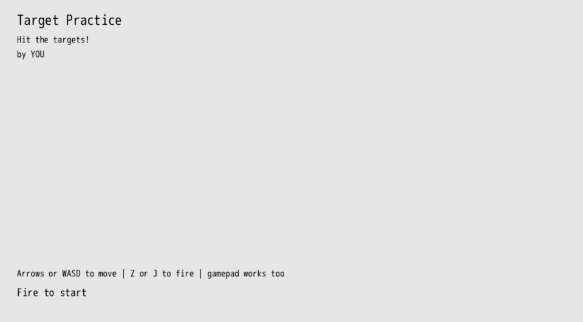

# Scenes

When making a game, there are all sorts of scenes that exist, from the main menu to the actual gameplay to the pause menu. Often these scenes have different interactions than the main game. Instead of moving your character around the world you instead move a cursor up and down menu options. In this chapter we'll refactor our main gameplay and game over state to be a bit easier to manage and then introduce a title scene that's used to start the game.

The concept of a "scene" isn't specific to DragonRuby Game Toolkit or any given game engine. It's just a generic concept that we're introducing to make our game code easier to work with. In GameMaker they're called "rooms" and in HaxeFlixel they're called "states." For our purposes, we'll move forward with scenes because they don't conflict with other terms in DragonRuby GTK, and much like a movie scene, it's clear when one ends and when one begins.

## Refactor

When we introduced the game over scene, we actually introduced our second scene. Kinda neat! But it wasn't the time to think about them in terms of scenes and reckon with how we add more.

So we've got two scenes right now: gameplay (where we shoot at targets) and game over (where we display the score and allow the player to restart). Let's refactor the code to put our scenes in different methods and allow the game to switch between them given certain conditions being met.

Containing our scenes in methods will make it much easier to change one scene without impacting the others. It sets clear boundaries and will make our code easier to maintain.

We've already got `#game_over_tick`, so we can make use of that to contain the game over behavior.

Let's introduce a `#gameplay_tick` method that will contain the logic for our gameplay. And then we'll use `args.state.scene` to keep track of the current scene. Then if we change that value, it'll change what scene our game uses.

Not much of the code changes, but we do shuffle things around a bit. None of the methods above `#game_over_tick` change, so they're excluded:

``` ruby
{{#include code/chapter_11/01_refactor/app/main.rb:50:204}}
```

`#game_over_tick` is the same except for the addition of:

``` ruby
args.state.timer -= 1
```

We need to continue to subtract from the timer in each tick since we rely upon it for when we accept input to restart the game.

We introduce `#gameplay_tick` which contains all of our logic for when we're actually playing the game. We set the background to the blue solid rectangle and initialize our player and animate the sprite. That's all the same.

But when the timer is `0`, after we pause the music and play the game over sound, we set `args.state.scene` to `"game_over"` and return early. This effectively changes the scene.

We continue to handle input and display the gameplay sprites and labels in `#gameplay_tick`.

Then, finally, `#tick` has been drastically simplified. It no longer needs to be responsible for so much. It can instead just handle three things:

1. starting the music for the game
2. Lazily initializing the scene to start with (in our case, `"gameplay"`)
3. Calling the proper scene tick method and passing in `args`

The third item there is the new part of this chapter. `#send` is a method in Ruby that allows a method to be called by passing in the name of the method as a parameter. This is really powerful! We use string interpolation to take the value set in `args.state.scene` and append it with `_tick`. Our game then calls that method and passes in `args` as the first parameter to the called method. So if `args.state.scene` is set to `"gameplay"`, the `#gameplay_tick` method gets called. If it's set to `"game_over"`, then `#game_over_tick` gets called. If it's set to `"credits"`, then `#credits_tick` would get called.

The various scene tick methods _need_ to exist in order for changing `args.state.scene` to work. But that's quite simple to do, we just introduce a new method and set `args.state.scene` to change between scenes.

## Title Scene

When player's launch our game, they get dropped right into the gameplay. This can be a bit jarring, so let's introduce a new scene that displays the title of the game, controls, and let's them press a button to start.

In our game code, let's introduce `#title_tick` that takes `args` as its only parameter, just like our other `*_tick` methods for our scenes. In `#title_tick`, we'll render some labels and look for input to start our game. If the fireball input is pressed, we'll play a sound effect, change the scene, and return early so we can move on to the next scene.

``` ruby
{{#include code/chapter_11/02_title/app/main.rb:196:232}}
```

Replace `YOU` with your name since you made it. It's important to take credit for your work.

Then in `#tick` lazily initialize `args.state.scene` to now be `"title"`:

``` ruby
{{#include code/chapter_11/02_title/app/main.rb:234:242}}
```

Now when you start the game, the title scene will be displayed:



When you press the fire button, the game will start. And when you restart after game over, you'll end up back on the title scene.

## Extra Credit

- Display a label with the current high score in the title scene so players know what to aim for
- Display the dragon sprite in the title scene to give a player a taste of what they can expect
- How could you make it so that the music doesn't start until gameplay starts? Or play different music during the title scene?
- Restarting the game back on the title scene may not be ideal. How would you change it so that restarting the game automatically goes to the `gameplay` scene?
- Allow players to pause the game while in the middle of the gameplay scene

## Summary

We've now got three scenes in our game and can easily switch between them. The code for each scene is contained within its own method, making it easier to change a given scene without accidentally changing the others. Adding another scene to our game, like a pause menu, wouldn't be very complicated.

## What's Next

For all intents and purposes our game is done! You can start it, play it, replay it, and we've got a title scene. All that's left to do is release it so that the world (or at the very least our friends) can play it.
