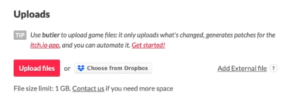
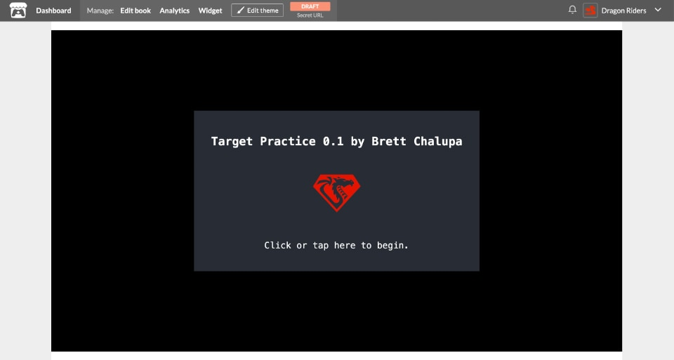

# Ship It!

So far you've been playing the debug development build of your game within the DragonRuby GTK engine. In order to get it to friends, we'll need to build versions for other players to use. We'll use the `dragonruby-publish` tool that comes with the engine to do so.

Releasing your game is a process that has only gotten easier and easier over time. One of the coolest things about DragonRuby GTK is that you can build your game for the web, Linux, Windows, and MacOS with one command.

We'll release _Target Practice_ on [itch.io](https://itch.io/), an open marketplace for distributing your game. You can share your games for free on Itch or sell them. The html version will even be able to be played in the browser. So go ahead and sign up for an Itch account.

## Prep for Release

While the code of our game is done ([view the finished source](https://github.com/DragonRidersUnite/book/tree/main/src/code/chapter_12/01_release)), we need to specify some info about the game, like its title and our information.

First, delete `mygame/high-score.txt`. We don't want our high-score from building the game to get released with the game version we share publicly. You'll need to make sure you do this every time before building your game. How could you turn the build and publishing process into a script that automatically does this for you?

In `mygame/metadata/` you find a file called `game_metadata.txt`. Open that up and specify the following values:

``` ruby
{{#include code/chapter_12/01_release/metadata/game_metadata.txt}}
```

Replace `devid` and `devtitle` with your username and name. The `version` is a value you can change as you're working on your game. It lets you and your players know which version they've got in case they're running an old build without the latest changes.

How you version your game is up to you, but I generally think about it like this:

- The structure is `MAJOR.MINOR`.
- While your game is actively being developed and isn't done, increase the minor number to the right of the `.` with each release, so `0.1`, `0.2`, and so on. Minor versions can go as high as you want, `0.24` or however many releases you have.
- When your game is done, increase the major version on the left of the `.` to 1, so it'd be version `1.0`. When you increase the major version of a piece of software, you reset the minor version back to 0.
- As you fix bugs and expand upon it after initial release, increase the number to the right, so `1.1`, `1.2`, and so on.
- If you ever majorly overhaul your game, you might want to consider bumping the major version to `2.0`.

If your eyes are glazing over at this versioning stuff, don't sweat it. It's something that may be more useful to you in time.

You'll also see that there's a `mygame/metadata/icon.png` file. The default DragonRuby logo is fine, but if you ever want a custom icon for your game, just change that file to be your own image. That's what'll be displayed as the application icon when people run your game.

## Publish Your Game

DragonRuby GTK makes it really easy to build your game for the web and the major operating systems and publish it right on Itch.

Open a new terminal. If you're using Visual Studio Code, there's an option to do so right within it. Don't be frightened by the terminal, we'll just be running a simple command to build our game for all of our platforms.

``` console
./dragonruby-publish --only-package
```

That command will build your game for all platforms DragonRuby GTK can target. Check out the `builds/` folder. You'll see all sorts of files that are your game builds.

Depending on what operating system your computer is using, you can even launch and play the release version of your game. On Linux, open `target-practice-linux-amd64.bin`. On MacOS, open `target-practice-mac-0.1/Target Practice.app`. On Windows, launch `target-practice-windows-amd64.exe`.

## Upload to Itch

Go to your [Itch Dashboard](https://itch.io/dashboard) and tap the "Create new project" button.

Fill out the details for your game. Be sure to write a description, add screenshots, and more. If you want your game to be played in the browser, set the type to HTML. But the most important part is that you upload your game.



Tap "Upload files" and select the zips of the game for all of the platforms you want to upload it for. For `target-practice-html5.zip`, check the "This file will be played in the browser" box, as Itch will use that to determine what to make playable. For the other platforms, choose the proper OS for each file. Be sure to set the web embed size to 1280 pixels wide and 720 pixels tall so it renders at the proper size.

If you make changes to your game, you can upload new versions to Itch automatically by running `./dragonruby-publish mygame` without having to upload them through the web browser as long as `gameid` in `game_metadata.txt` matches your Itch project slug.

Save your game on Itch and then view it. You'll see it download and run your game by displaying the splash screen:



Your game isn't published _yet_. Only you can see it for now. If you want to share an early build with a friend, you can get a secret URL to send from the top navigation bar on Itch when viewing your game. Or go back to editing your game and set the **Visibility & access** to be public to launch it.

When you're happy with your game and ready for the world to play it, make it public!

## You Shipped a Game!

Can you believe it? That's awesome! You've got a game you can share with your friends.

Congratulations, and nice work on sticking through the book.
