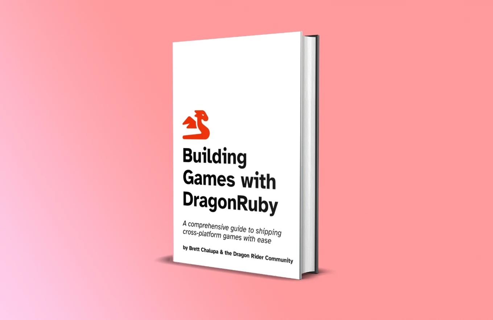
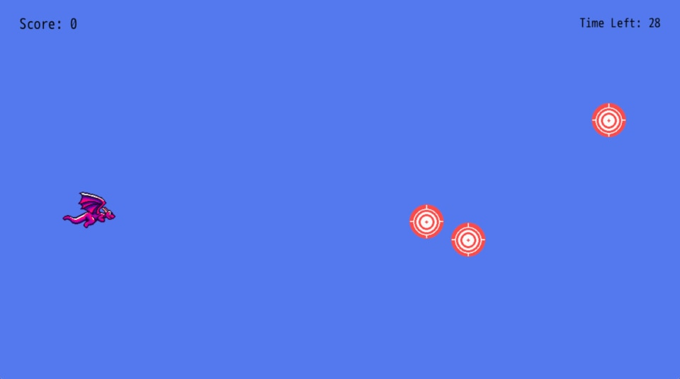
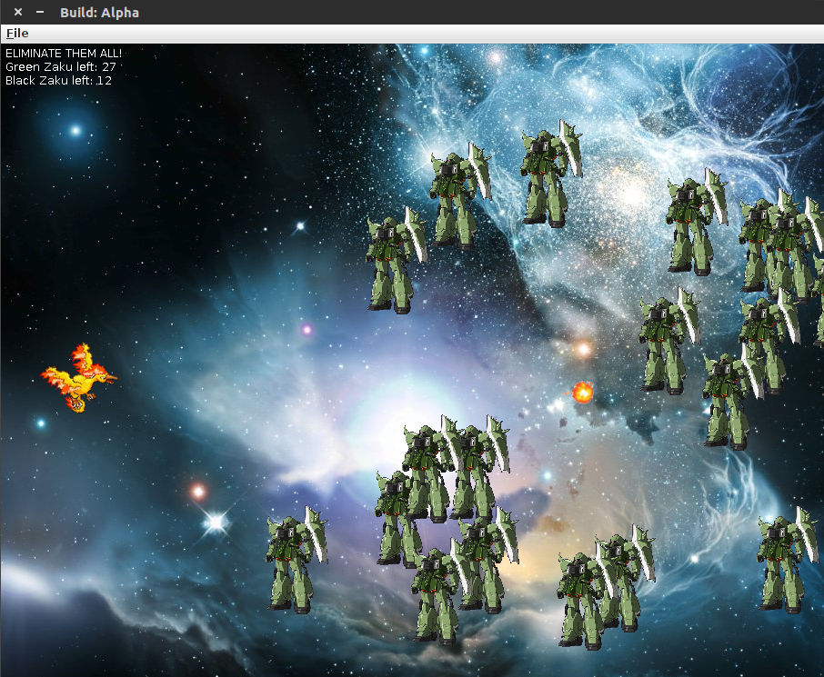

# Introduction

This book is aimed at new game developers who are interested in learning to code and build games. If you've written code before, especially Ruby, then you'll have a bit of a head start. But the concepts in this book are beginner friendly. Whether you're new to game dev or just DragonRuby Game Toolkit, you'll have made a finished game by the end of this.

You need no prior experience with programming or game making to follow this book.

Here are some kind things people have said about the book:

> Reading _Building Games with DragonRuby_ book was a breath of fresh air to me.

> This is nuts! Great work with the book.

> Thanks for the book, I really enjoyed the writing style!

## Why Learn How to Make Games

Making games is a total blast. It's challenging but rewarding. They're the sum total of many creative mediums, _plus_ they're interactive. You'll learn so many different skills by making games:

- Programming and logic
- Rendering images
- Responding to input
- Game design
- Interactive design
- Working with image files
- Editing audio files
- Distributing the game software to users
- Getting feedback from your game and iterating to make it better

Whether your dream is to make games as your profession or just as a hobby, I think it's a creative practice worth pursuing.

## About DragonRuby Game Toolkit

[DragonRuby Game Toolkit](https://dragonruby.org/toolkit/game) (DRGTK) is a cross-platform game engine for building 2D games. It lets you write games in Ruby, a wonderfully expressive and approachable language. It allows you to quickly iterate on your games and ship them to any modern platform—modern operating systems, mobile devices, and game consoles.

DRGTK is **not** a no-code engine. You'll write the code that makes your game run. This may seem scary at first, but it's a lot of fun and really powerful. Making games is also a great way to learn how to code! Don't know Ruby? That's okay, this book will teach you what you need to know.

### But it isn't free!

DRGTK costs money, yes. And there are plenty of free game engines out there. But the DRGTK team is committed to sustainably working on the engine and making it the best it can be, which means they need to get paid for their work. Support small teams by buying their software. Paying for software shows you're interested, and it helps them keep doing what they love.

You're investing in the engine and ecosystem, quite literally, by buying DRGTK. I want to see it succeed, so I bought a license. I want to see it succeed so badly I've written this book to try to help _you_ make games with it. The more successful DragonRuby Game Toolkit is, the better it will be for everyone making games with it.

Plus, if you're a student or in need of financial assistance, the DragonRuby team offers free licenses. [Get in touch with the team to get a free license.](https://dragonruby.org/toolkit/game)

There's also [a free, interactive environment online](https://fiddle.dragonruby.org) you can use to sample DragonRuby GTK. Give it a try and see what you think!

## Why DragonRuby Game Toolkit

There are more game engines, frameworks, and libraries than I can count on my hands and toes. So why should you use DragonRuby Game Toolkit?

That's a legit question. Here are my reasons why:

- It's focused on 2D games, so there are no competing interests in how the tooling works. It means what you need to know is pretty simple and easy to remember.
- It makes it _so_ simple to distribute games for all modern platforms, from desktop computers to the web to mobile devices to consoles. It's truly cross-platform and _just works_, which is amazing.
- It's fast a heck, which is important for making quality games.
- It makes use of Ruby, which is a wonderfully productive programming language.
- It doesn't force you to use a specific editor or tooling.
- It's lightweight to run the engine, which means you can make games on any computer, even a Raspberry Pi.
- It has live-reload and no compile times, which means when you change your game code, it automatically refreshes in the running engine. This is honestly so amazing. You wouldn't know how incredible this is unless you've used other game engines that require you compile your game with each change.

I'm going to be honest, DRGTK might not be for you. If you want to make 3D games, look elsewhere. Although, if you're new to game development, I wouldn't recommend starting with a 3D game. If you're absolutely not willing to try coding, look elsewhere.

But for everyone else, I think DRGTK will knock your socks off (or at least shift them down a little).

## Mindset

When learning something new, especially something that's challenging, it's important to have the right mindset.

- Be curious: it's the best way to learn!
- Be patient: learning is difficult, but stick with it
- Be kind: to yourself and others

When we learn how to play a new instrument, we learn the basics by covering simplistic pieces of music. Similarly, we're going to "cover" simpler game mechanics to get you started. Before long, you'll grasp the basics and be able to move onto more complex games and mechanics.

Start by making small games that you can finish in a couple of days. Make a lot of small games to learn quickly. Don't get too wrapped up in your dream idea or making something that gets on Steam. Definitely don't try to make an MMORPG. Instead, focus on **shipping** your small games.

What's shipping? Isn't that when you want Mulder and Scully to kiss? No! Get your head out of the gutter you alien-loving freak. (I want to believe! 🛸) Shipping is when you 1. finish your game and 2. release it for people to play it.

So here's your mindset, boiled down: make a small game and ship it for free, then make another small game and ship it for free. Before long, you'll be building a visual novel where Mulder and Scully kiss. Now, imagine yourself swimming in a pool of cryptocoins! But seriously, what that iterative mindset will do is help you grow as a developer, build a fanbase, and get your shipping muscle primed and ready for making a better game each time.

## What We'll Be Making

Throughout the book, we'll be building a simple shoot-'em-up where you pilot a dragon. Our game will be called _Target Practice_. You'll learn all of the foundational aspects of making a game:

- The game loop
- Rendering text
- Rendering sprites and animating them
- Handling input
- Playing sound effects and music
- Polishing your game
- Shipping it!

[🎮 Play the game right in your browser!](https://dragonridersunite.itch.io/dragonruby-book) (You can even download it for your OS.)

## Hold the Gosh Dang Phone

"Who the heck are _you_?" you might be shouting at your screen. Little ole me? I'm just the voice of the dragon that lives within all beings! No, no, I kid. I'm Brett! I'm a programmer who enjoys making games and sharing what I've learned along the way.

That's-a-me! If I was a bunch of pixels I guess.

I love Ruby. I've been writing it for over 12 years, and it's such a joy. I also love games. Particularly 2D ones. So here we are. 💎 + ❤️ + 🎮 = 📕 How's that for an equation?!

You want me to be serious about why you should listen to me? Oh, you skipped this section, okay fine. Wow, did you drop that banana peel there? You trying to take me out already? This early in the book? Well, I'll see you in the next chapter! We'll see who gets the last laugh.

## Why the Book is Free

When I was 16, I took a computer science class in high school. It was my first exposure to programming with a language more complex than HTML and CSS. We programmed in Java. For some odd reason, my teacher had us print out our assignments for grading.

That class was foundational in the course my life would take in the 14 years since. At age 16 I was an emo kid who loved video games and anime. Imagine a swoopy haired teen in their bedroom listening to Bright Eyes while playing _Final Fantasy XII_. That was me.

So naturally, for my final project in that high school computer science class I made a game. You pilot a Moltres from Pokemon who shoots fireballs at Zaku mechs from Gundam that fly across the screen. If you get hit by an enemy, it's game over. If you defeat all of the enemies, you win. This game was lovingly titled _Zaku Space Battle_.

In order to make that game, I followed a free online tutorial that laid out the foundations of making a game with Java. There was no way I would have figured out on my own how to make a game at that point without help from a free online tutorial. I had _so_ much fun making that final project that I went to college to study game programming and do programming for my career. I took what I learned from that tutorial, expanded the functionality, and made it my own (with copyright sprites, but still!).

This book is freely accessible so that someone who loves games and wants to try making them can do so. Free programming resources have truly shaped my life and career. So this book is my way of giving back and trying to help other developers.

You'll learn the foundations of game programming and making games, as well as some more advanced topics. If this book can help even just one person start and finish a game, it's worth every minute I've spent on it. We'll make a game not too dissimilar from _Zaku Space Battle_. Once you finish it, take what you've learned and make it your own!

If you want to, you can [buy me a coffee](https://buymeacoffee.com/brettchalupa) or [subscribe to my newsletter](https://buttondown.email/brettchalupa) as a way of saying thank you. It's much appreciated.

## Contribute

This book is open source. That means anyone can view the code that builds it and contribute toward making it better. Did you find something that doesn't work, contains a typo, or lacks clarity? [Submit an issue or contribute on GitHub.](https://github.com/DragonRidersUnite/book) It's easy, and you can do it right from your browser. Thanks in advance!

If you're stuck and would like some extra assistance, reach out in [the DragonRuby Discord](https://discord.dragonruby.org). We'll get you unstuck!

## How to Read the Book

Each chapter builds upon the last. You'll go from displaying a single image to making a full game by the end of the book. The code that's added and changed is explained in detail, but you can [always find the source code for each chapter on GitHub](https://github.com/DragonRidersUnite/book/tree/main/src/code).

Code alongside the book, but feel free to make adjustments and experiment if you're feeling excited.

Prefer an offline version? [You can find a PDF and HTML version for download on the Itch page.](https://dragonridersunite.itch.io/dragonruby-book)

## Get Started

All right, are you ready to make a game? Let's get started!
